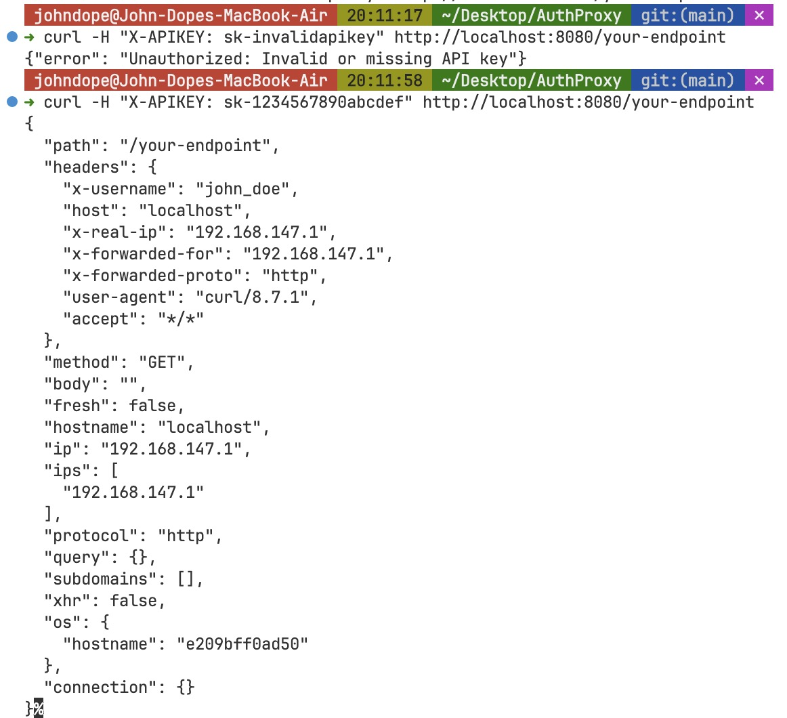

 
  <a href="../README.md">English</a> 
  ·
  <a href="README_fr.md">Français</a>
  ·
  <a href="README_de.md">Deutsch</a>
  ·
  <a href="README_zh-cn.md">简体中文</a>  
  ·
  <a href="README_zh-tw.md">繁體中文</a>
  ·
  <a href="README_kr.md">한국어</a> 
  ·
  <a href="README_pt.md">Português</a>

**Proteja suas APIs em segundos.** Um gateway de API ultra-rápido, baseado em nginx, que bloqueia usuários maliciosos enquanto mantém seu tráfego legítimo fluindo suavemente.

  
  
  

## 🎯 Por que AuthProxy?

**Pare o abuso de API antes que ele comece.** Seja você executando uma API pública, microsserviços internos ou qualquer coisa entre os dois, o AuthProxy atua como seu segurança digital - deixando os bons entrarem enquanto mantém os maus do lado de fora.

### O Problema
- 💸 **Abuso de API custa dinheiro** - Usuários não autorizados consumindo seus recursos
- 🐌 **Soluções tradicionais são pesadas** - Plataformas complexas de gerenciamento de API que te deixam lento
- 🔒 **Falhas de segurança são caras** - Uma única violação pode custar milhões
- ⚡ **Velocidade importa** - Cada milissegundo de latência prejudica seus usuários

### A Solução
AuthProxy oferece **proteção de API de nível empresarial** com a simplicidade de um único arquivo de configuração. Sem bancos de dados, sem configuração complexa, sem bloqueio de fornecedor.

[Continuação da documentação em português...]

## 📄 Licença

Licença MIT - Use, modifique, distribua. Nós acreditamos em código aberto.

---

**Pronto para proteger suas APIs?**

[⚡ Comece Agora](#-guia-de-início-rápido) | [📖 Leia a Documentação](https://your-docs-url.com) | [🌟 Estrela no GitHub](https://github.com/yourusername/AuthProxy)

*Construído com ❤️ para desenvolvedores que valorizam velocidade, segurança e simplicidade.*

 