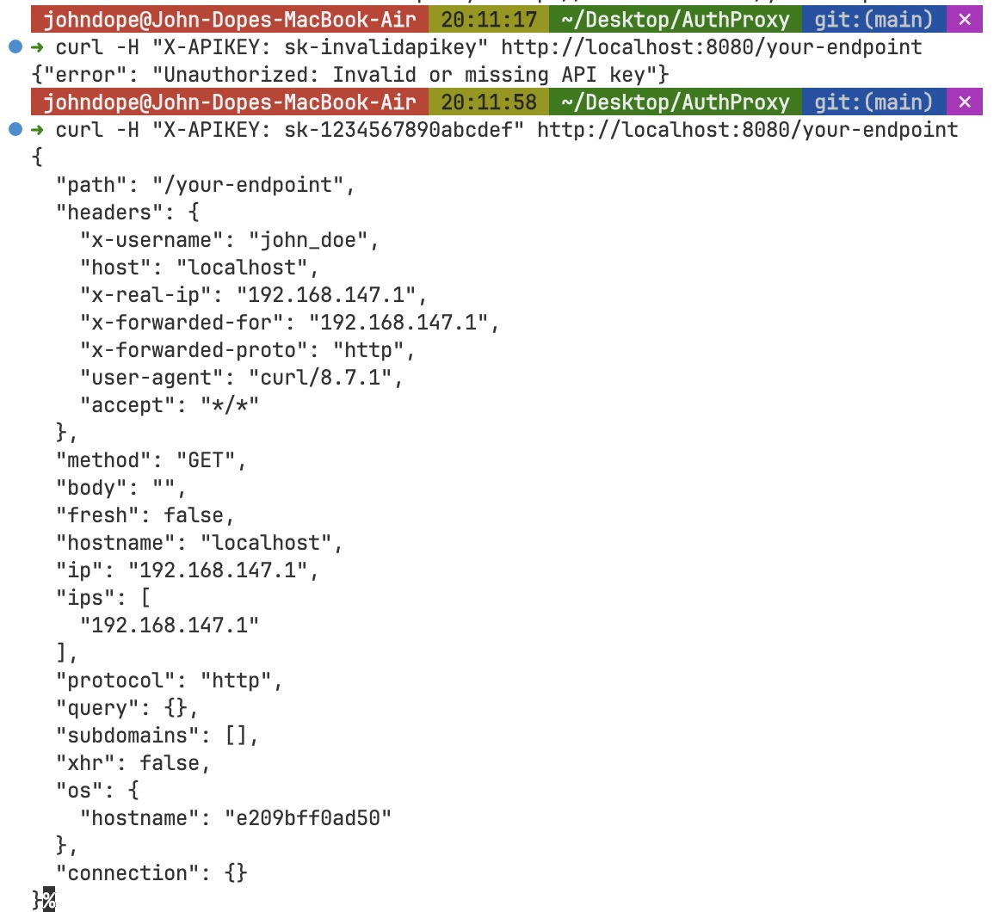

<p align="center"> 
  <a href="../README.md">English</a> 
  ·
  <a href="README_fr.md">Français</a>
  ·
  <a href="README_de.md">Deutsch</a>
  ·
  <a href="README_zh-cn.md">简体中文</a>  
  ·
  <a href="README_zh-tw.md">繁體中文</a>
  ·
  <a href="README_kr.md">한국어</a> 
  ·
  <a href="README_pt.md">Português</a>
</p>

<p align="center">

</p>

> 純粹、不摻雜的活力編碼驅動著這個強大的專案。

**幾秒鐘內保護您的API。** 一個基於nginx的超快速API閘道器，可以有效阻止惡意用戶，同時保持合法流量順暢運行。

<p align="center">
  <a href="https://hub.docker.com/r/johndope/auth-proxy">
    
  </a>
  <a href="https://github.com/john-theo/auth-proxy">
    
  </a>
  <a href="https://github.com/john-theo/auth-proxy">
    
  </a>
</p>



> ⤷ 如果這些圖片無法顯示，您可以[在Github上查看](https://github.com/john-theo/auth-proxy)

## 🎯 為什麼選擇AuthProxy？

**在API濫用開始之前就阻止它。** 無論您是運行公共API、內部微服務還是介於兩者之間的任何服務，AuthProxy都充當您的數字門衛 - 讓好人進來，同時把壞人擋在外面。

### 問題
- 💸 **API濫用會造成成本** - 未經授權的用戶消耗您的資源
- 🐌 **傳統解決方案太重** - 複雜的API管理平台會降低您的速度
- 🔒 **安全漏洞代價高昂** - 一次洩露可能造成數百萬損失
- ⚡ **速度至關重要** - 每一毫秒的延遲都會影響您的用戶

### 解決方案
AuthProxy通過單個配置文件的簡單性為您提供**企業級API保護**。無需數據庫，無需複雜設置，無供應商鎖定。

## ✨ 主要優勢

### 🏎️ **閃電般速度**
- **基於nginx** - 全球最受信任的網頁伺服器
- **零數據庫架構** - 無查詢延遲，純粹速度
- **最小佔用** - 不會拖慢您的基礎設施

### 🔐 **堅不可摧的安全性**
- **API金鑰認證** - 只有授權用戶才能通過
- **可配置的速率限制** - 徹底阻止暴力攻擊
- **用戶名映射** - 準確知道誰在使用您的API

### 🚀 **幾分鐘內部署**
- **單一配置文件** - 所有設置集中一處
- **Docker就緒** - `docker-compose up` 即可完成
- **無外部依賴** - 在任何支持Docker的地方運行

### 💰 **成本效益**
- **無授權費用** - 完全免費和開源
- **資源佔用最小** - 在最小的伺服器上運行
- **防止濫用** - 在產生成本之前阻止未授權使用

## 🎬 實際操作

```bash
# 1. 克隆並配置（30秒）
git clone https://github.com/yourusername/AuthProxy.git
cd AuthProxy
vim .env  # 檢查是否需要更改默認常量
vim api-keys.map  # 在此以純文本配置apikey-username映射

# 2. 開始保護您的API（10秒）
docker-compose up -d

# 3. 測試是否正常工作（5秒）
curl http://localhost:8080/health
# ✅ OK

# 4. 您的API現在受到保護！
curl -H "X-APIKEY: sk-1234567890abcdef" http://localhost:8080/your-endpoint
```

本專案使用一個演示後端，它會回顯用戶請求的主體和標頭。您將看到類似這樣的內容：

```json
{
  "path": "/your-endpoint",
  "headers": {
    "x-username": "john_doe",  // 🔥 這是由AuthProxy添加的！
    "host": "localhost",
    "x-real-ip": "192.168.147.1",
    "x-forwarded-for": "192.168.147.1",
    "x-forwarded-proto": "http",
    "user-agent": "curl/8.7.1",
    "accept": "*/*"
  },
  "method": "GET",
  "body": "",
  "fresh": false,
  "hostname": "localhost",
  "ip": "192.168.147.1",
  "ips": [
    "192.168.147.1"
  ],
  "protocol": "http",
  "query": {},
  "subdomains": [],
  "xhr": false,
  "os": {
    "hostname": "a608b96726bc"
  },
  "connection": {}
}
```

**就是這樣！** 您的API現在受到生產就緒的閘道器保護。

## 🛡️ 您將獲得

### **智能速率限制**
- **未授權用戶**：每分鐘10個請求（可配置）
- **授權用戶**：每分鐘60個請求（可配置）
- **全局安全網**：防止服務過載
- **突發處理**：平滑流量尖峰

### **安全的API金鑰管理**
- **簡單映射文件** - 無數據庫複雜性
- **用戶名注入** - 後端知道誰在調用
- **金鑰輪換就緒** - 輕鬆更新金鑰
- **標頭剝離** - API金鑰永不到達後端

### **生產就緒**
- **健康監控** - 內建健康檢查
- **全面日誌記錄** - 追蹤所有內容
- **安全標頭** - XSS、CSRF、點擊劫持保護
- **連接池** - 最佳後端性能

## 🔧 完美適用於

- **🌐 公共API** - 防止濫用並實現使用貨幣化
- **🏢 內部API** - 保護微服務通信
- **🔄 遺留系統** - 為現有服務添加現代認證
- **🚀 初創企業** - 企業級安全性，無企業級複雜性
- **☁️ 雲原生** - Kubernetes和Docker就緒

## 📊 重要性能指標

```
🔥 閃電般速度
├── <1ms延遲開銷
├── 10,000+請求/秒
├── <50MB記憶體使用
└── 99.9%正常運行時間能力

🔒 安全第一
├── API金鑰認證
├── 速率限制保護
├── DDoS緩解
├── 安全標頭
└── 請求淨化
```

## 🧪 經過戰鬥測試

AuthProxy配備全面的測試：

```bash
# 安裝測試依賴
npm install

# 運行完整測試套件
npm test

# 測試涵蓋：
# ✅ API金鑰認證
# ✅ 速率限制執行
# ✅ 負載測試場景
# ✅ 安全標頭
# ✅ 健康監控
```

## ⚙️ 完全可配置

AuthProxy設計為通過環境變量完全可配置。所有內容都通過單個`.env`文件控制：

### 🔑 **最重要的變量**

```bash
# 基本設置
NGINX_EXTERNAL_PORT=8080         # 對外暴露的端口
BACKEND_HOST=your-backend-server # 您的實際API伺服器
BACKEND_PORT=8080               # 您的後端端口

# API金鑰配置
API_KEY_HEADER=x_apikey         # nginx變量名（小寫帶下劃線）
API_KEY_HEADER_NAME=X-APIKEY    # 實際HTTP標頭名

# 速率限制（您的第一道防線）
UNAUTHORIZED_RATE_LIMIT=10r/m   # 無API金鑰時的每分鐘請求數
AUTHORIZED_RATE_LIMIT=60r/m     # 有效API金鑰的每分鐘請求數
AUTHORIZED_BURST=10             # 允許流量突發
```

### 📋 **完整環境變量參考**

#### **🌐 網絡和代理**
```bash
NGINX_EXTERNAL_PORT=8080        # 外部端口（用戶連接的端口）
NGINX_PORT=80                   # 內部nginx端口
INTERNAL_AUTH_PORT=8081         # 內部401伺服器端口
```

#### **🎯 後端配置**
```bash
BACKEND_HOST=backend            # 後端伺服器主機名
BACKEND_PORT=8080              # 後端伺服器端口
BACKEND_MAX_FAILS=3            # 標記為不健康前的最大失敗嘗試次數
BACKEND_FAIL_TIMEOUT=30s       # 重試失敗後端前等待時間
```

#### **🔄 連接池**
```bash
BACKEND_KEEPALIVE_CONNECTIONS=32  # 保持活動連接數
BACKEND_KEEPALIVE_REQUESTS=100    # 每個連接的最大請求數
BACKEND_KEEPALIVE_TIMEOUT=60s     # 保持連接開啟的時間
```

#### **⏱️ 超時設置**
```bash
PROXY_CONNECT_TIMEOUT=30s       # 建立後端連接的時間
PROXY_SEND_TIMEOUT=30s          # 發送請求到後端的時間
PROXY_READ_TIMEOUT=30s          # 從後端接收響應的時間
```

#### **🚦 速率限制**
```bash
RATE_LIMIT_MEMORY=10m           # 分配給速率限制的記憶體
UNAUTHORIZED_RATE_LIMIT=10r/m   # 無API金鑰請求的速率限制
AUTHORIZED_RATE_LIMIT=60r/m     # 有API金鑰請求的速率限制
GLOBAL_RATE_LIMIT=30r/m         # 全局速率限制後備
AUTHORIZED_BURST=10             # 授權用戶的突發容量
```

#### **🔐 API金鑰標頭配置**
```bash
API_KEY_HEADER=x_apikey         # nginx變量名（小寫帶下劃線）
API_KEY_HEADER_NAME=X-APIKEY    # 實際HTTP標頭名用於測試和代理清除
```

### 🎛️ **配置示例**

#### **高流量生產環境**
```bash
NGINX_EXTERNAL_PORT=80
AUTHORIZED_RATE_LIMIT=300r/m
AUTHORIZED_BURST=50
BACKEND_KEEPALIVE_CONNECTIONS=64
WORKER_CONNECTIONS=2048
```

#### **開發環境**
```bash
NGINX_EXTERNAL_PORT=8080
UNAUTHORIZED_RATE_LIMIT=30r/m
AUTHORIZED_RATE_LIMIT=120r/m
PROXY_READ_TIMEOUT=300s  # 更長的超時用於調試
```

#### **安全優先設置**
```bash
UNAUTHORIZED_RATE_LIMIT=5r/m     # 非常嚴格
AUTHORIZED_RATE_LIMIT=30r/m      # 保守
AUTHORIZED_BURST=3               # 最小突發
BACKEND_MAX_FAILS=1              # 快速失敗
```

#### **自定義API金鑰標頭**
```bash
# 對於X-API-KEY標頭
API_KEY_HEADER=x_api_key
API_KEY_HEADER_NAME=X-API-KEY

# 對於X-CUSTOM-AUTH標頭
API_KEY_HEADER=x_custom_auth
API_KEY_HEADER_NAME=X-CUSTOM-AUTH
```

### 🔧 **快速配置提示**

1. **從默認值開始** - 開箱即用效果很好
2. **調整速率限制** - 基於您的流量模式
3. **監控和調優** - 使用健康端點和日誌
4. **徹底測試** - 使用包含的測試套件

```bash
# 測試您的配置
docker-compose config
curl http://localhost:8080/health
```

## 📈 實際影響

**使用AuthProxy之前：**
- 🚨 API濫用侵蝕利潤
- 🐌 複雜的API管理開銷
- 💸 昂貴的企業解決方案
- 🔧 耗時的設置和維護

**使用AuthProxy之後：**
- ✅ API濫用在閘道器處被阻止
- ⚡ 閃電般的請求處理
- 💰 零授權成本
- 🚀 5分鐘部署時間

## 🤝 貢獻

我們歡迎貢獻！無論是：
- 🐛 錯誤報告
- 💡 功能建議
- 🔧 代碼改進
- 📖 文檔更新

查看我們的[貢獻指南](CONTRIBUTING.md)開始。

## 📄 授權條款

MIT授權條款 - 使用它，修改它，分發它。我們相信開源。

---

<div align="center">

**準備好保護您的API了嗎？**

[⚡ 立即開始](#-快速入門指南) | [📖 閱讀文檔](https://your-docs-url.com) | [🌟 在GitHub上加星](https://github.com/yourusername/AuthProxy)

*用❤️為重視速度、安全性和簡單性的開發者打造。*

</div> 